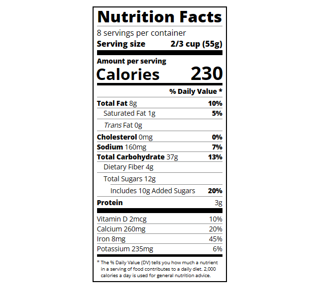
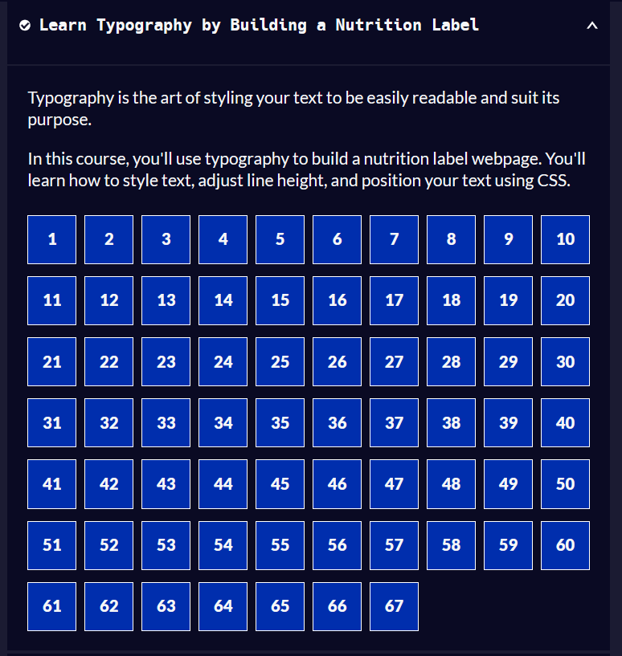

# Nutrition Label
The purpose of this repo is to monitor my progress in learning HTML by making a Nutrition Label. I am utilizing the freeCodeCamp [Learn Typography by Building a Nutrition Label](https://www.freecodecamp.org/learn/2022/responsive-web-design/#learn-typography-by-building-a-nutrition-label) for this repo.

## Screenshots

    
    

## Learnings
1. Making two columnn alignment
2. Using CSS to modify tags in HTML
3. Using div tags to group elements
4. Using span tags to group elements
5. Utilizing classes to quickly modify multiple elements like making the text bold. You can also use classes to have different size of divider like normal, medium and large.